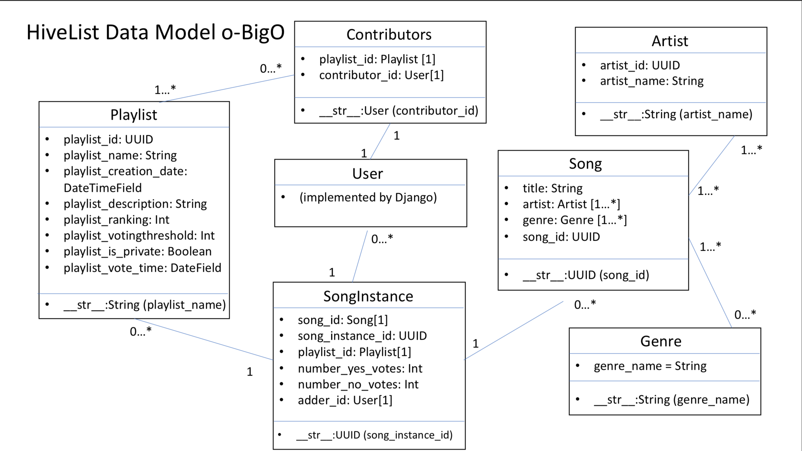

Checklist by points:
[x]	Inclusion of title (3 points)
[]	Inclusion of each section (12 points)
[x]	Proper usage of the english language and well written (5 points)
[]	Solid description and presentation of the following sections (10 points):
	[EE]	User Interface (2 points)
	[]	Data Model (2 points)
	[]	URL Routes/Mappings (2 points)
	[]	Authentication/Authorization (2 points)
	[]	Team Choice (2 points)

Checklist by section:
[x]	Title
[x]	Subtitle
[x] Semester
[x] Overview
[x] Team Members
[EE]	UI
[]	Data Model
[JT]	URL Routes/Mapping
[JT]	Authentication/Authorization
[]	Team Choice
[]	Conclusion

# Title: O-Big O

## Subtitle: HiveList
## Semester: Fall 2018

# Overview: 
HiveList is a collaborative playlist builder. The application allows several users to collectively build a playlist by voting on which songs they believe should be added. The users can also change the playlist’s settings. Finally, the website also implements features which allow users to explore popular songs/playlists, keep track of recently played playlist, and the ability to change one's profile information. 
Our application is unique mostly because of the voting feature. Now you can build playlists with songs that people agree on, instead of having a single person spamming the playlist with songs no one wants to hear.

# Team Members: 
## Caleb Carr, Collin Giguere, Emily Earl, Jay Trask, Olivia Higgins, Omar Sanchez

# User Interface:

* Welcome Page:
	* This is the first page that a user will get to when they come to our website. Here they are introduced to what HiveList is. From here they can also log in if they already have an account, or they can create a new one
	

* Log In Page:
	* If the user already has an account, they can log in here. They put their username and password into the boxes. If they put in valid information, then it will sign them in and redirect them to the home page. If they put invalid credentials, then it will stay on this page and show an error message.
	

* Sign Up Page:
	* If the user does not have an account, then they can make an account here. They put in what they'd like for their username, password, email, and name. If the password is valid, then it will sign in the user and bring them to the home page.
	

* Home Page:
	* Once the user is signed in, they will come to this page. This home page features some things specific to the user and then some general information to inspire the user. On the left it shows the signed in user's in progress playlists. These are playlists with songs that can still be voted on. On the bottom left there is a list of the top 10 playlists on HiveList, and in the middle are some other public playlists that the user can look into and be inspired by. On the far right, there is the username of the logged-in user.
	

* Explore Page:
	* On this page, the top 10 playlists and songs are shown. It also has a filter on the right where you can start typing in a genre, and it will filter the songs by the genre you type in. This page is to introduce the user to the most popular songs and to encourage them to put them in their playlists.
	

* My Lists Page:
	* This page shows playlists specific to the user that is signed in. The In-Progress playlists on the left have a voting date in the future, so people can still vote on songs within the playlist. The finished playlists on the right have voting dates that have passed. You can access each of the playlists on this page to change information, vote on songs, or just look at the songs in them.
	

* New Playlist Page:
	* If you want to make a new playlist, this is the place to do it. The user enters in the information on the screen, including a name, description, when the voting period stops, a percentage for how many votes it needs to pass, and whether or not it should be listed as private. If the information is correct, then it will bring you back to the MyLists page and your new playlist will be there.
	

* Specific Playlist Page:
	* This is where you can see the information for a specific playlist. You can add a song on the right by finding it in the dropdown menu. When you select "add", it will then be put in the set list on the left. You can vote "yes" or "no" for each of the songs on the playlist. In the future, we would make it so once the voting period passes, songs with a certain percentage of votes will be finalized and the ones that are below that percentage will be removed. The list of contributors to this playlist is also displayed in the bottom right.
	

* Playlist Settings Page:
	* If you want to change the settings, you would get to this page. Right now it is not functional, but it shows the title, voting settings, contributor settings, description, and whether or not it is public or private. In the future, we'd make it so all these could be changed in this screen.
	

* Profile Page:
	* This page shows things specific to the user. It shows playlists that this user is the owner of on the left. It also shows user settings, including the user's email. This is also where a user could change their password, and this is functional. 
	

* Special Notes about these Pages:
	* When a user is on the screens Welcome, Log In, and Sign Up, the navigation bar does not have all the things it has when the user is signed in. This is so a person can't access those pages unless they are signed in with a valid account. The HiveList logo still works, but it will only bring them back to the Welcome Screen
	* Navigation bar works on all pages when you are logged in.
	* Log out works on every page, and this will bring you back to the log in screen.

# Data Model: A final up-to-date diagram of your data model including a brief description of each of the entities in your model and their relationships.

	* 
	* Playlist
		* This is a playlist that has songs and other specific information, as listed in the model, such as an id, a name, when it was created, description, ranking, voting threshold, whether or not it is private, and when voting for songs will end.
		* This has a 1...* relationship with contributors, because a playlist will have at least one contributor, and in the other direction it is 0...* because contributors will add to either 0 or many playlists. 
		* A playlist can have no instances of a song, but then it will have songs added to it. Each song instance is only in one playlist though, because it is created when a song is put in a playlist, and then that songinstance will only belong there.

	* Contributors
		* These are users who have added to a specific playlist
		* The contributor will only be associated with one playlist, but a playlist can have 1 to many contributors.
		* Contributors has a 1-1 relationship with User, and it is very similar to it. 

	* User
		* This is implemented by Django for us.
		* It has a 1-1 relationship with contributors.
		* A user can add either 0 or many SongInstances, and a SongInstance is associated with only one user, the one who added the song.

	* Song Instance
		* Song Instance is an instance of a song. This is so it can be added to a playlist and each of the instances of the song will have its own voting information.
		* A user can add either 0 or many SongInstances, and a SongInstance is associated with only one user, the one who added the song.
		* A SongInstance is associated with only one playlist. A playlist starts out with 0 SongInstances, but then has SongInstances added to it.
		* A SongInstance is related to one Song, and it shares the same name. This is like the BookInstance model in this case. A Song can have 0 or many SongInstances.

	* Song
		* A song in our model has the title, artist, genre, and an id associated with it.
		* A SongInstance is related to one Song, and it shares the same name. This is like the BookInstance model in this case. A Song can have 0 or many SongInstances.
		* A song must have at least one artist, and an artist must have at least one song to be included in our data.
		* A song has at least one genre, but a genre can have 0 or many songs related to it.

	* Genre
		* We have a list of the most popular genres of music.
		* A song has at least one genre, but a genre can have 0 or many songs related to it.

	* Artist
		* Each artist gets an id and a name.
		* A song must have at least one artist, and an artist must have at least one song to be included in our data.

# URL Routes/Mappings:

* / 
	* The index page of our application allows two options; login and register, both of which redirect you to the login/registration pages provided by django.

* currentPlaylist/<uuid:playlist_id>
	* The currentPlaylist page is passed a playlist_id.  This page shows the current playlist, allowing the user to add songs as well as vote on songs.

* home/
	* The user is redirected to the home page after logging in. The home page contains an overview of in progress/finished playlists as well as some statistical data such as top 10 playlists and popular songs.

* explore/
	* The explore page shows the user suggested songs and playlists.

* mylists/
	* The mylists page displays a users in progress as well as finished playlists, with the option to redirect to any of said playlist's detail page.

* profile/
	* The profile page displays basic information about the user as well as includes forms to change around users settings.

* playlistSettings/
	* Playlist settings allow the user to alter an instance of a playlist.

* signup/
	* The sign-up page integrates django's user authentication, and redirects the user to the login page upon success.

* mylists/create_playlist/
	* This URL brings the user to a form to create a new playlist. Upon completion the user will be redirected to the mylists page.

* currentPlaylist/upvote/<uuid:playlist_id>/<uuid:song_instance_id>
	* This url is the redirect for when a user upvotes a song instance in a playlist. The playlist_id is passed so that the user may be redirected to the same currentplaylist page, and the song_instance_id is passed in order to increment the instance in the database.

* currentPlaylist/downvote/<uuid:playlist_id>/<uuid:song_instance_id>
	* This url is the redirect for when a user downvotes a song instance in a playlist. The playlist_id is passed so that the user may be redirected to the same currentplaylist page, and the song_instance_id is passed in order to increment the instance in the database.

* Note: All pages except for the login, index, and signup pages have a redirect to the login page if the user is not currently logged in.

# Authentication/Authorization:

* All user authentication is done through the provided django authentication methods. This includes logging in as well as registering. 
* As the application heavily relies on information provided to the application given the user (Most of the application is simply displaying information about playlists that the user is a contributor of) all pages aside from the index, login, and registration page provide a redirect to the login page if the user is not logged in.

# Team Choice: From submission 3, we were able to implement:
* create playlist form
	* description
* playlist editing 
	* description
* voting functionality.
	* description
* Instead of focusing on implementing the lost password function, we worked on javascript that allowed the explore page to filter the songs by genre with a functioning search bar. 

***Conclusion: A conclusion describing your team’s experience in working on this project. This should include what you learned through the design and implementation process, the difficulties you encountered, what your team would have liked to know before starting the project that would have helped you later, and any other technical hurdles that your team encountered.***

Designing the project was fun with our group and we enjoyed working together to plan what we wanted the website to look like. When we started designing and implementing the interface, we learned a lot about HTML and CSS and especially how to link URLs to other pages which was a little difficult for us. Implementing the data model was the next step, and the team learned a lot about SQL databases and how to make them correctly. We had a lot of trouble with the user model because we tried to extend it at first, but we ended up using djangos default model and it fit our needs fine. Next was implementing features of the app itself. We added the ability to create a playlist and add it to the database, but we had trouble with editing the playlist. We also added functionality for each playlist to have songs on them and vote for their spot on the playlist. Adding songs to playlists was not so hard, and neither was displaying them on the explore pages, but allowing users to vote was by far the most difficult thing we had encountered during the project. Almost every member had been working on it for a few days by the time we finally got it to work. I think something we would have liked to know before starting the project is that djangos user model would work fine for us, so that we wouldnt have spent time trying to extend it and failing.
