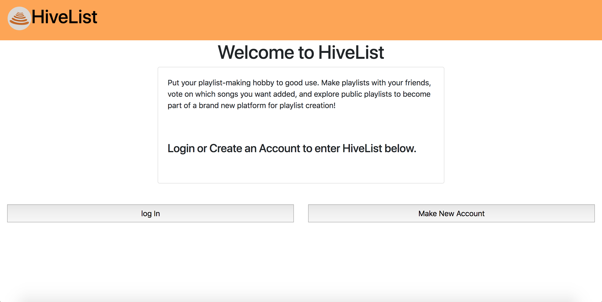
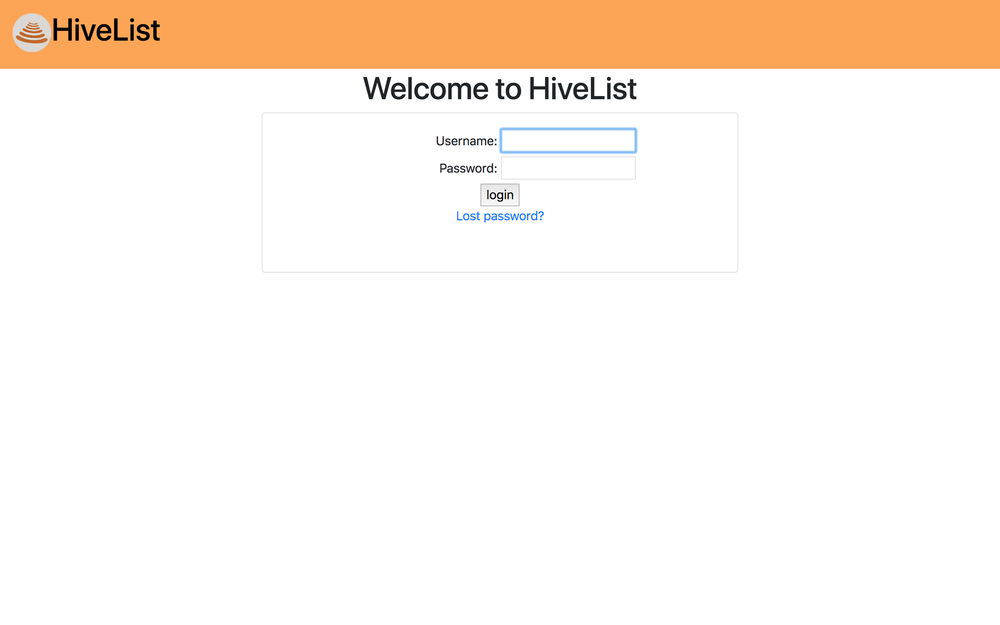
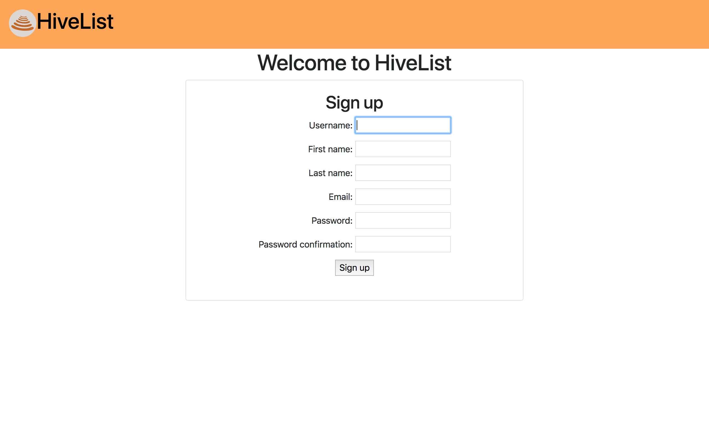
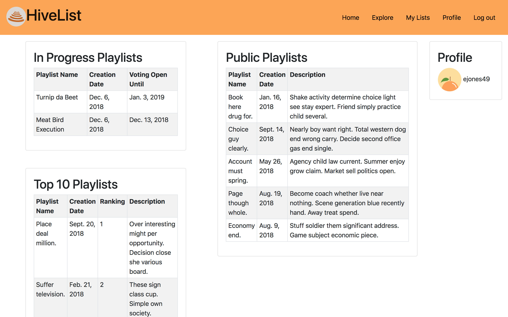
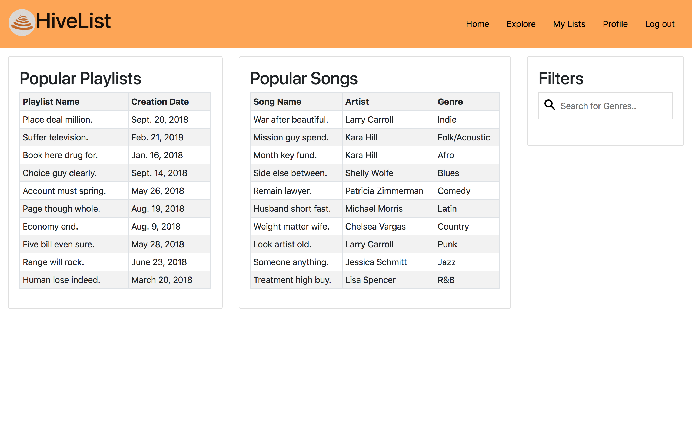
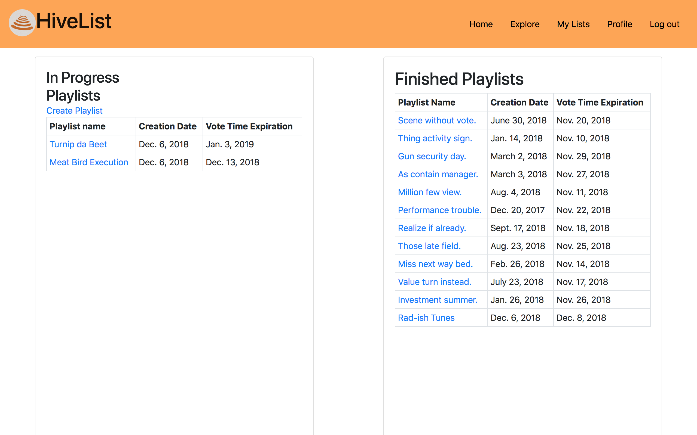
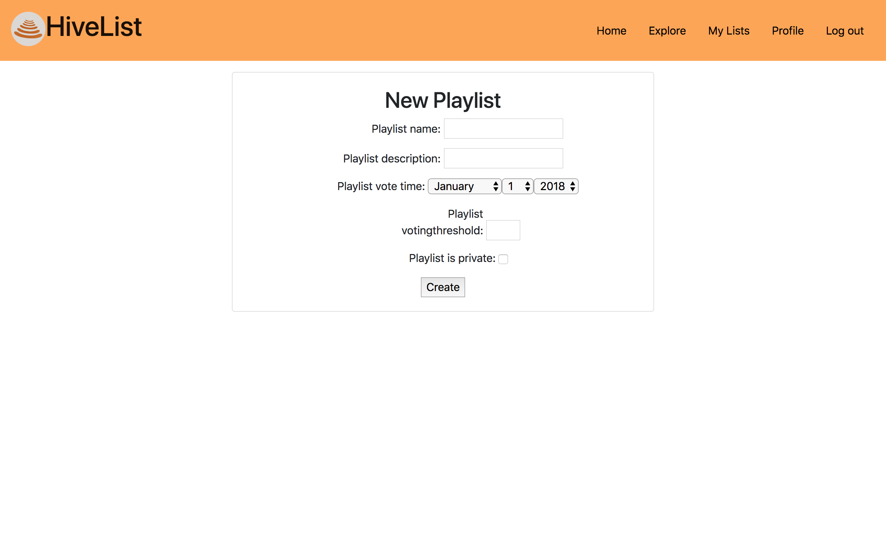
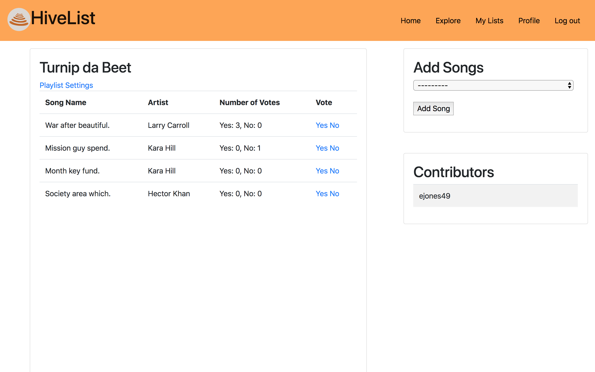
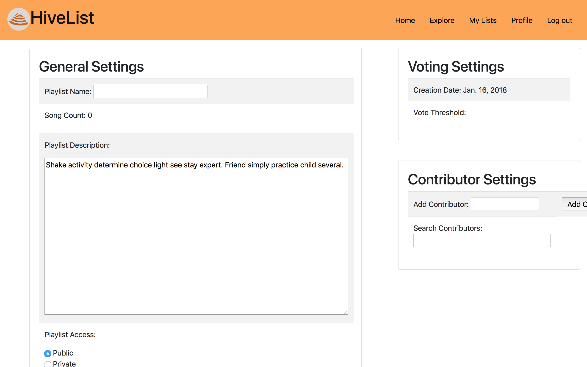
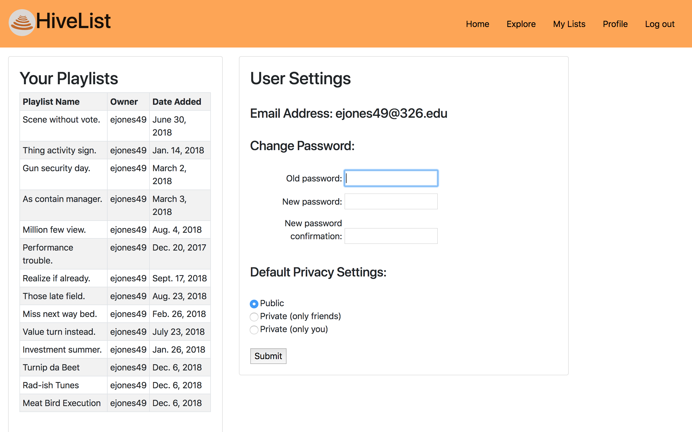

Checklist by points:
[x]	Inclusion of title (3 points)
[]	Inclusion of each section (12 points)
[x]	Proper usage of the english language and well written (5 points)
[]	Solid description and presentation of the following sections (10 points):
	[EE]	User Interface (2 points)
	[]	Data Model (2 points)
	[]	URL Routes/Mappings (2 points)
	[]	Authentication/Authorization (2 points)
	[]	Team Choice (2 points)

Checklist by section:
[x]	Title
[x]	Subtitle
[x] Semester
[x] Overview
[x] Team Members
[EE]	UI
[]	Data Model
[]	URL Routes/Mapping
[]	Authentication/Authorization
[]	Team Choice
[]	Conclusion

Title: O-Big O

Subtitle: HiveList

Semester: Fall 2018

Overview: HiveList is a collaborative playlist builder. The application allows several users to collectively build a playlist by voting on which songs they believe should be added. The users can also change the playlist’s settings. Finally, the website also implements features which allow users to explore popular songs/playlists, keep track of recently played playlist, and the ability to change one's profile information. 
Our application is unique mostly because of the voting feature. Now you can build playlists with songs that people agree on, instead of having a single person spamming the playlist with songs no one wants to hear.

Team Members: Caleb Carr, Collin Giguere, Emily Earl, Jay Trask, Olivia Higgins, Omar Sanchez

#User Interface: A final up-to-date list/table describing your application’s user interface. This should include the name of the UI view and its purpose. You should include a screenshot of each of your UI views.

*Welcome Page:
	*This is the first page that a user will get to when they come to our website. Here they are introduced to what HiveList is. From here they can also log in if they already have an account, or they can create a new one
	

*Log In Page:
	*If the user already has an account, they can log in here. They put their username and password into the boxes. If they put in valid information, then it will sign them in and redirect them to the home page. If they put invalid credentials, then it will stay on this page and show an error message.
	

*Sign Up Page:
	*If the user does not have an account, then they can make an account here. They put in what they'd like for their username, password, email, and name. If the password is valid, then it will sign in the user and bring them to the home page.
	

*Home Page:
	*Once the user is signed in, they will come to this page. This home page features some things specific to the user and then some general information to inspire the user. On the left it shows the signed in user's in progress playlists. These are playlists with songs that can still be voted on. On the bottom left there is a list of the top 10 playlists on HiveList, and in the middle are some other public playlists that the user can look into and be inspired by. On the far right, there is the username of the logged-in user.
	

*Explore Page:
	*On this page, the top 10 playlists and songs are shown. It also has a filter on the right where you can start typing in a genre, and it will filter the songs by the genre you type in. This page is to introduce the user to the most popular songs and to encourage them to put them in their playlists.
	

*My Lists Page:
	*This page shows playlists specific to the user that is signed in. The In-Progress playlists on the left have a voting date in the future, so people can still vote on songs within the playlist. The finished playlists on the right have voting dates that have passed. You can access each of the playlists on this page to change information, vote on songs, or just look at the songs in them.
	

*New Playlist Page:
	*If you want to make a new playlist, this is the place to do it. The user enters in the information on the screen, including a name, description, when the voting period stops, a percentage for how many votes it needs to pass, and whether or not it should be listed as private. If the information is correct, then it will bring you back to the MyLists page and your new playlist will be there.
	

*Specific Playlist Page:
	*This is where you can see the information for a specific playlist. You can add a song on the right by finding it in the dropdown menu. When you select "add", it will then be put in the set list on the left. You can vote "yes" or "no" for each of the songs on the playlist. In the future, we would make it so once the voting period passes, songs with a certain percentage of votes will be finalized and the ones that are below that percentage will be removed. The list of contributors to this playlist is also displayed in the bottom right.
	

*Playlist Settings Page:
	*If you want to change the settings, you would get to this page. Right now it is not functional, but it shows the title, voting settings, contributor settings, description, and whether or not it is public or private. In the future, we'd make it so all these could be changed in this screen.
	

*Profile Page:
	*This page shows things specific to the user. It shows playlists that this user is the owner of on the left. It also shows user settings, including the user's email. This is also where a user could change their password, and this is functional. 
	

*Special Notes about these Pages:
	*When a user is on the screens Welcome, Log In, and Sign Up, the navigation bar does not have all the things it has when the user is signed in. This is so a person can't access those pages unless they are signed in with a valid account. The HiveList logo still works, but it will only bring them back to the Welcome Screen
	*Navigation bar works on all pages when you are logged in.
	*Log out works on every page, and this will bring you back to the log in screen.

***Data Model: A final up-to-date diagram of your data model including a brief description of each of the entities in your model and their relationships.

***URL Routes/Mappings: A final up-to-date table of all the URL routes that your application supports and a short description of what those routes are used for. You should also indicate any authentication and permissions on those routes.

***Authentication/Authorization: A final up-to-date description of how users are authenticated and any permissions for specific users (if any) that you used in your application. You should mention how they relate to which UI views are accessible.

***Team Choice: You should briefly mention your team choice component for your application. You should highlight any additions to your application that are part of your team choice, such as, URL routes, UI views, data model, to make it clear what your team choice addition is.

***Conclusion: A conclusion describing your team’s experience in working on this project. This should include what you learned through the design and implementation process, the difficulties you encountered, what your team would have liked to know before starting the project that would have helped you later, and any other technical hurdles that your team encountered.
